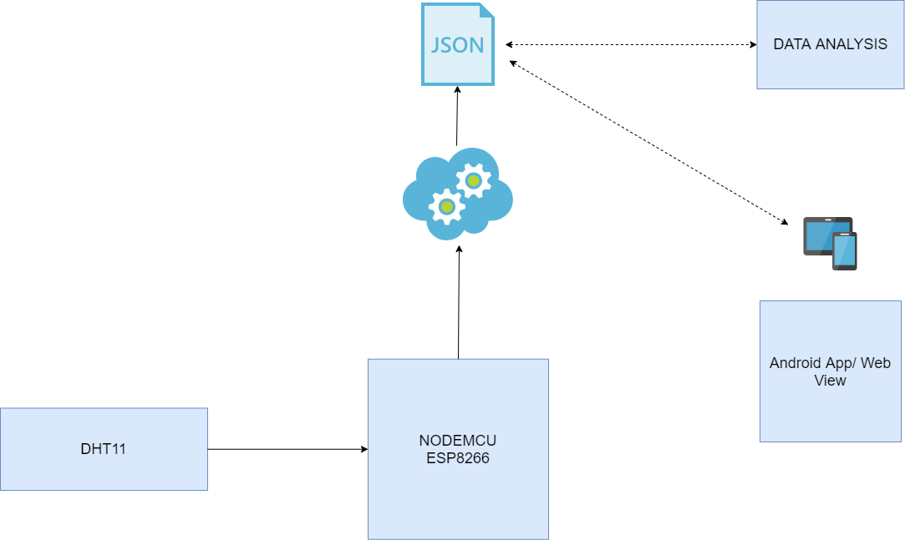
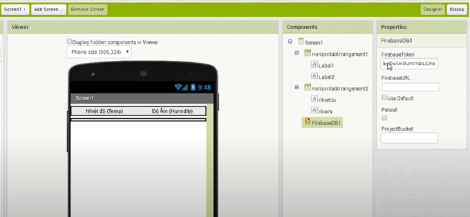

Ứng dụng IOT, xây dựng app giám sát nhiệt độ và độ ẩm realtime. Thu thập dữ liệu từ sensor và xây dựng mô hình dự báo bằng python
## Phương pháp thực hiện 
Phương pháp được phát triển gồm các bước sau.
**Bước 1:** NodeMcu thu thập thông tin từ cảm biến DHT11 dựa trên mã được kết xuất trong bộ vi điều khiển NODEMCU và gửi dữ liệu lên Firebase
**Bước 2:** Dữ liệu thu thập từ firebase được lưu dưới dạng json. 
**Bước 3:** Thuật toán sử dụng để hiển thị dữ liệu về thời tiết.
**Bước 4:** Kết quả được hiển thị trong chế độ xem Arduino IDE, Firebase, Webserver và Android App.

|  | 
|:--:| 
| *System Architecture Diagram* |

|  | 
|:--:| 
| *Processing Flow diagram* |

|  | 
|:--:| 
| *Sơ đồ mạch* |

## Các thư viện cần thiết cho Adruino
- **Firebase Arduino Library:** Thư viện giúp người dùng thực hiện các thao tác với Firebase Realtime Database
- **Arduino JSON Library** Thư viện này giúp làm việc với chuỗi JSON
- **DHT11 & ESP8266 Library** Thư viện giúp làm với với cảm biến DHT11 và ESP8266 board
- **NTPClient Library** Thư viện này giúp kết nối và đồng bộ với NTP time server

## Tạo Android App (MIT App Inventor và Google Firebase)

Sau khi thiết lập thành công, chúng ta qua bước tạo ứng dụng android để giao tiếp với dữ liệu realtime. Tại khung setting của Firebase, copy cái web API key:

Tạo một giao diện app đơn giản như hình dưới. Cái web API key hồi nãy, các bạn paste vào chỗ Firebase Token

Còn đây là giao diện lập trình ứng dụng

## Tạo Web App (HTML và JavaScript)

Copy file "PageIndex.h" (Giao diện cho web server) bỏ vào cùng thư mục chứa file code chính (đuôi file .ino)

Rồi up lên host, API thì lấy từ Firebase.

## Kết quả

|  | 
|:--:| 
| *Nhiệt độ và độ ẩm hiển thị trên Adruino* |

|  | 
|:--:| 
| *Nhiệt độ và độ ẩm hiển thị trên Firebase* |

|  | 
|:--:| 
| *Nhiệt độ và độ ẩm hiển thị trên Android App* |

|  | 
|:--:| 
| *Nhiệt độ và độ ẩm hiển thị trên Web App* |
